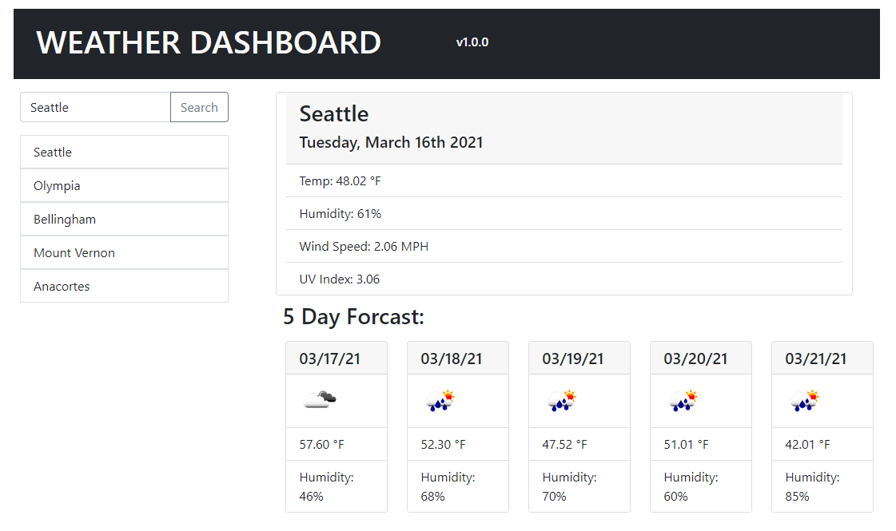

# Weather Dashboard
## UW-FSF Coding Bootcamp HW Unit 6
Current weather and 5 day forcast for searched cities with a (localStorage) history.

## Description
This is a Weather Dashboard using OpenWeatherMap.org's API.

You enter a city to search, it will make two api calls:
- The first is to get location data for the city requested.
- The second is to use the location data to get current weather, and the 5 day forcast.

The current weather and 5 day forcast is displayed after a search.

The searched city is added to a list of searched cities, up to 7.

### Links

[Deployed Application](https://epowelldev.github.io/u05-weather-dashboard/)

[GitHub Repo](https://github.com/epowelldev/u05-weather-dashboard)